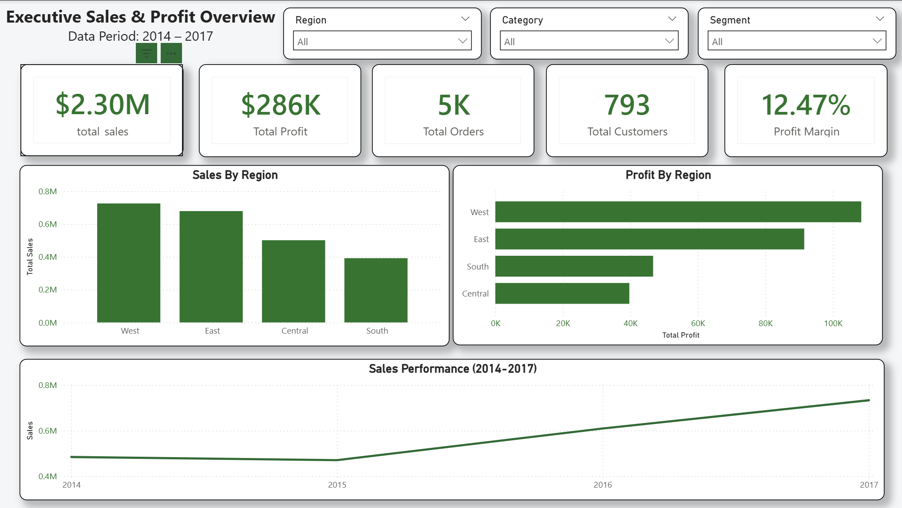
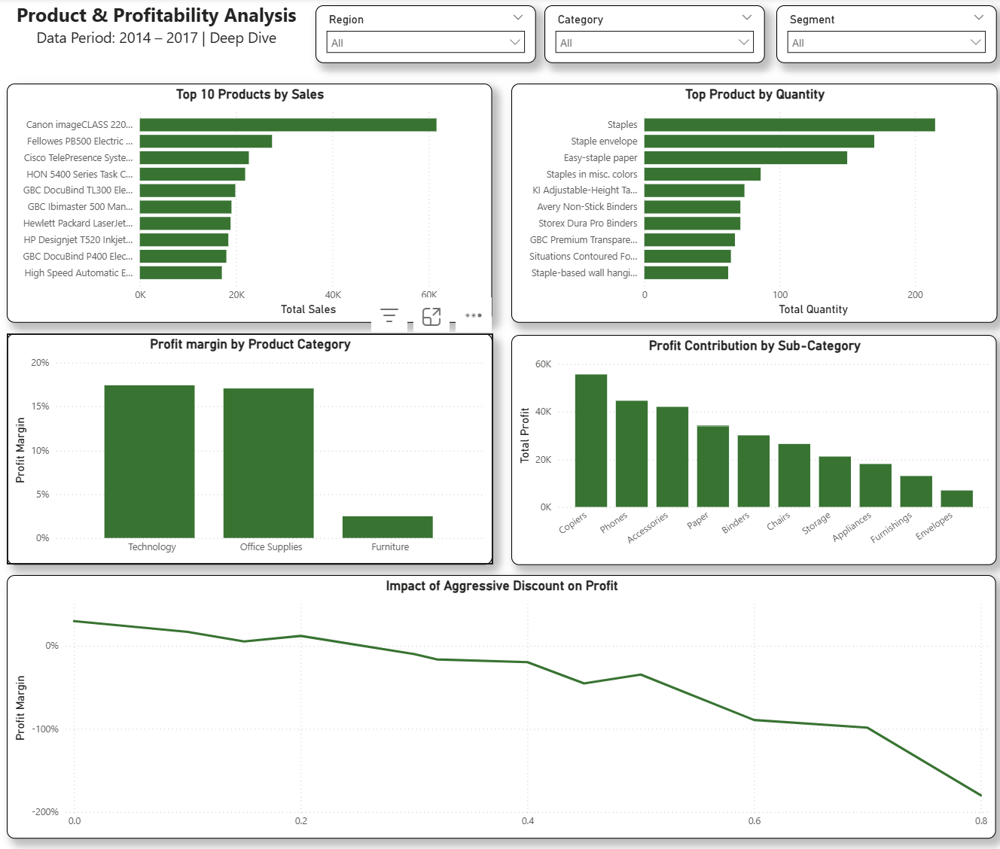
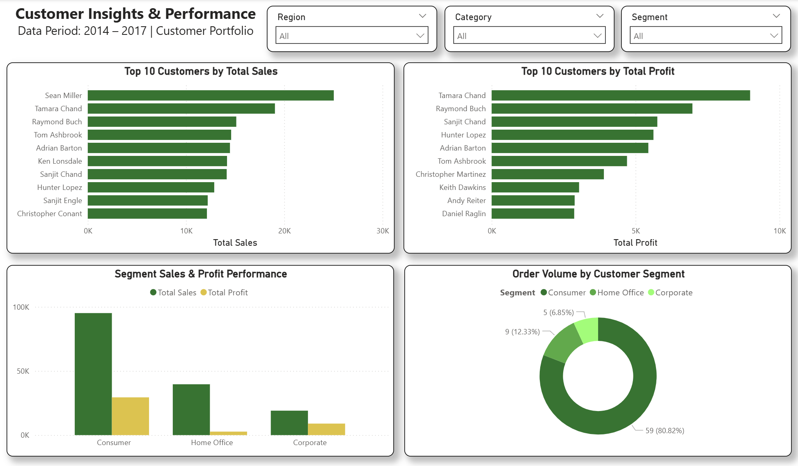

# 📊 Super Store Sales Analytics

An end-to-end data analytics project that explores sales performance, customer behavior, profitability, and business growth opportunities using the Super Store dataset.

## Project Overview

This project analyzes the **Super Store** dataset using PostgreSQL to uncover insights related to sales performance, customer behavior, product profitability, discount strategies, and regional performance.

The objective is to transform raw transactional data into actionable business insights that support decision-making in areas such as **pricing, inventory planning, customer retention, and profit optimization**.

## 🛠️ Tools Used

- PostgreSQL
- SQL
- Power BI
- GitHub

## 🔄 Project Workflow

```text
CSV Dataset
   ↓
Data Cleaning
   ↓
PostgreSQL
   ↓
SQL Analysis
   ↓
Business Insights
   ↓
Power BI Dashboard
   ↓
Strategic Recommendations
```

## 🗂️ Dataset

The dataset contains transactional records from **2014–2017**, including:

- Orders
- Customers
- Products
- Sales
- Profit
- Discounts
- Regions
- Customer Segments

---

## 📑 Table of Contents

- [🖥️ Power BI Dashboard Preview](#️-power-bi-dashboard-preview)
- [1. Customer Insights](#1--customer-insights-customer_analysissql)
- [2. Product Analysis](#2--product-analysis-product_analysissql)
- [3. Profitability Analysis](#3--profitability-analysis-profitability_analysissql)
- [4. Sales & Trend Analysis](#4--sales--trend-analysis-sales_analysissql)
- [📁 Repository Structure](#-repository-structure)
- [📋 Executive Strategic Summary](#-executive-strategic-summary)
- [🚀 Skills Demonstrated](#-skills-demonstrated)
- [✅ Conclusion](#-conclusion)

---

## 🖥️ Power BI Dashboard Preview

### Executive Overview


### Product & Profitability Analysis


### Customer Analysis


> 📦 The full interactive `.pbix` file is available in the [`powerbi/`](powerbi/superstore_dashboard.pbix) folder.

---

## 1. 🧑‍💼 Customer Insights (`customer_analysis.sql`)

### Top 10 Customers by Sales

**Business Question:** Who are the top 10 customers by total spending?

```sql
SELECT
    customer_name,
    COUNT(DISTINCT(order_id)) AS total_orders,
    SUM(sales) AS total_spent,
    SUM(profit) AS total_profit
FROM super_store
GROUP BY customer_name
ORDER BY total_spent DESC
LIMIT 10;
```

> 💡 **Key Insight**
> - High spending customers do not always generate high profits.
> - Some customers contribute significant revenue but produce low or even negative profitability.
> - Businesses should evaluate customer profitability alongside sales performance.

### Top 10 Customers by Profit

**Business Question:** Who are the most profitable customers?

```sql
SELECT
    customer_name,
    COUNT(DISTINCT(order_id)) AS total_orders,
    SUM(sales) AS total_spent,
    SUM(profit) AS total_profit
FROM super_store
GROUP BY customer_name
ORDER BY total_profit DESC
LIMIT 10;
```

> 💡 **Key Insight**
> - A small group of customers contributes a disproportionate share of total profit.
> - These customers represent valuable long-term assets and should be prioritized through retention and loyalty programs.

### Customer Segment Analysis

**Business Question:** Which customer segment contributes the most orders, sales, and profit?

```sql
SELECT
    segment,
    COUNT(DISTINCT(order_id)) AS total_orders,
    SUM(sales) AS total_sales,
    SUM(profit) AS total_profit
FROM super_store
GROUP BY segment
ORDER BY total_orders DESC;
```

> 💡 **Key Insight**
> - The **Consumer** segment generates the highest number of orders.
> - Consumer customers also contribute the largest share of sales and profit.
> - This segment remains the primary driver of overall business performance.

---

## 2. 📦 Product Analysis (`product_analysis.sql`)

### Top 10 Products by Quantity Sold

**Business Question:** Which products are purchased most frequently?

```sql
SELECT
    product_name,
    SUM(quantity) AS total_quantity_sold,
    SUM(sales) AS total_sales
FROM super_store
GROUP BY product_name
ORDER BY total_quantity_sold DESC
LIMIT 10;
```

> 💡 **Key Insight**
> - Office supply products dominate sales volume.
> - Frequently purchased items generate steady demand but relatively low revenue.
> - These products are important for maintaining customer engagement and recurring purchases.

### Category Profitability Analysis

**Business Question:** Which categories generate the highest and lowest profit margins?

```sql
SELECT
    category,
    SUM(sales) AS total_sales,
    SUM(profit) AS total_profit,
    ROUND(SUM(profit)/SUM(sales)*100, 2) AS profit_margin
FROM super_store
GROUP BY category
ORDER BY profit_margin ASC;
```

> 💡 **Key Insight**
> - **Furniture** generates strong revenue but produces the lowest profit margin.
> - **Office Supplies** and **Technology** operate with significantly stronger profitability.
> - Furniture requires additional investigation to identify the causes of low margins.

### Product Profit Winners and Losers

**Business Question:** Which products generate the highest profit and largest losses?

> 💡 **Key Insight**
> - High-performing technology products contribute significantly to total profit.
> - Some specialized technology products generate substantial losses.
> - Product-level profitability should be monitored to prevent losses from offsetting gains elsewhere.

---

## 3. 💰 Profitability Analysis (`profitability_analysis.sql`)

### Sub-Category Profit Margin Analysis

**Business Question:** Which sub-categories are the most and least profitable?

```sql
SELECT
    category,
    sub_category,
    ROUND((SUM(profit) / NULLIF(SUM(sales), 0)) * 100, 2) AS profit_margin
FROM super_store
GROUP BY category, sub_category
ORDER BY category, profit_margin DESC;
```

> 💡 **Key Insight**
> - Several Office Supply sub-categories maintain exceptionally high profit margins.
> - Certain Furniture sub-categories generate losses despite contributing meaningful sales.
> - Sub-category analysis helps identify specific operational weaknesses.

### Discount vs Profit Analysis

**Business Question:** How do discounts affect profitability?

```sql
SELECT
    CASE
        WHEN discount = 0 THEN '0%'
        WHEN discount < 0.1 THEN '0%-9%'
        WHEN discount < 0.2 THEN '10%-19%'
        WHEN discount < 0.3 THEN '20%-29%'
        WHEN discount < 0.4 THEN '30%-39%'
        ELSE '40%+'
    END AS discount_category,
    COUNT(DISTINCT(order_id)) AS total_order,
    SUM(sales) AS total_sales,
    SUM(profit) AS total_profit,
    ROUND((SUM(profit) * 100) / SUM(sales), 2) AS profit_margin
FROM super_store
GROUP BY 1;
```

> 💡 **Key Insight**
> - Profit margins decline as discount levels increase.
> - Heavy discounting significantly reduces profitability.
> - Excessive discounts can eliminate profits entirely and should be carefully controlled.

### Profitability by Region

**Business Question:** Which regions generate the most profit?

```sql
SELECT
    region,
    SUM(sales) AS total_sales,
    SUM(profit) AS total_profit,
    ROUND((SUM(profit)/SUM(sales))*100, 2) AS profit_margin
FROM super_store
GROUP BY region
ORDER BY total_profit DESC;
```

> 💡 **Key Insight**
> - The **West** region generates the highest sales and profit.
> - Regional profitability varies considerably despite similar sales performance.
> - Geographic performance should be considered when allocating resources and marketing budgets.

---

## 4. 📈 Sales & Trend Analysis (`sales_analysis.sql`)

### Sales Performance by Region

**Business Question:** Which region generates the highest sales?

```sql
SELECT
    region,
    SUM(sales) AS total_sales
FROM super_store
GROUP BY region
ORDER BY total_sales DESC;
```

> 💡 **Key Insight**
> - The **West** region leads overall sales performance.
> - West and East contribute the majority of company revenue.
> - South generates the lowest sales and may require additional growth initiatives.

### Annual Sales Trend

**Business Question:** How has sales performance changed over time?

```sql
SELECT
    EXTRACT(YEAR FROM order_date::DATE) AS year,
    SUM(sales) AS total_sales
FROM super_store
GROUP BY year
ORDER BY year;
```

> 💡 **Key Insight**
> - Sales demonstrate strong growth between 2014 and 2017.
> - Revenue expansion indicates increasing market demand and business growth.

### Monthly Sales Trend (2017)

**Business Question:** How did sales perform throughout 2017?

```sql
SELECT
    TO_CHAR(order_date::DATE, 'Mon') AS month,
    SUM(sales) AS total_sales
FROM super_store
WHERE EXTRACT(YEAR FROM order_date::DATE) = 2017
GROUP BY
    EXTRACT(MONTH FROM order_date::DATE),
    TO_CHAR(order_date::DATE, 'Mon')
ORDER BY
    EXTRACT(MONTH FROM order_date::DATE);
```

> 💡 **Key Insight**
> - Sales increased steadily throughout the year.
> - **Q4 (October–December)** delivered the strongest performance.
> - **November** recorded the highest monthly sales.
> - Seasonal demand patterns should guide inventory and marketing planning.

---

## 📁 Repository Structure

```text
project/
│
├── data/
│
├── sql/
│   ├── customer_analysis.sql
│   ├── product_analysis.sql
│   ├── profitability_analysis.sql
│   └── sales_analysis.sql
│
├── powerbi/
│   └── superstore_dashboard.pbix
│
├── images/
│   ├── executive_overview.png
│   ├── product_profitability.png
│   └── customer_analysis.png
│
└── README.md
```

---

## 📋 Executive Strategic Summary

Based on the analysis, the following recommendations are proposed:

| Priority | Recommendation | Business Impact |
|----------|-----------------|------------------|
| 🔴 High | Implement stricter discount controls | Prevent margin erosion and improve profitability |
| 🔴 High | Improve Furniture category performance | Address low margins and increase overall profit |
| 🟡 Medium | Prioritize high-profit customers | Improve customer retention and lifetime value |
| 🟡 Medium | Focus on profitable regions | Optimize resource allocation and marketing spend |
| 🟡 Medium | Prepare for Q4 demand spikes | Improve inventory planning and customer service |

---

## 🚀 Skills Demonstrated

| SQL | Power BI | Business Analysis |
|---|---|---|
| Aggregations | KPI Cards | Customer Insights |
| CASE Statements | Interactive Dashboards | Product Performance |
| Profitability Analysis | DAX Measures | Profitability Optimization |
| Customer Segmentation | Slicers & Filters | Sales Trend Analysis |
| Trend Analysis | Data Visualization | Strategic Recommendations |
| Business Reporting | | |

---

## ✅ Conclusion

This analysis reveals several important business opportunities:

- The **West** region is the strongest contributor to both sales and profit.
- **Consumer** customers represent the company's largest customer segment.
- **Technology** products drive substantial profitability, while **Furniture** remains a weak-performing category.
- Excessive discounting significantly reduces profit margins.
- Sales consistently peak during **Q4**, highlighting strong seasonal demand patterns.

By optimizing discount strategies, improving underperforming categories, and focusing on high-value customers, the business can increase profitability while maintaining long-term sales growth.

---

## 👤 Author

**KY SOTHEARITH**

*SQL • PostgreSQL • Power BI • Data Analytics Portfolio Project*
